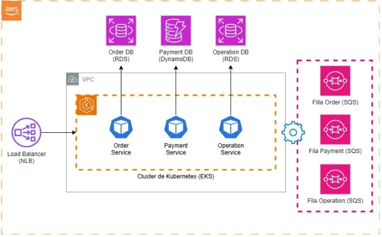
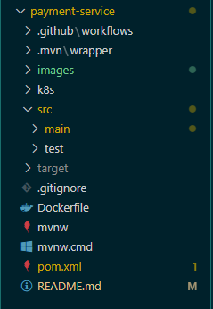

# Payment Service

# Order Service

# Operation Service

# Nome do Projeto

O **18Burguers** é um sistema de autoatendimento desenvolvido para a lanchonete de mesmo nome com o objetivo principal de oferecer aos seus clientes uma experiência eficiente, única e confiável na realização de pedidos, desde a seleção dos produtos até a sua entrega final.

## Objetivo do Sistema

O objetivo principal do **18Burguers** é fornecer um sistema de autoatendimento que permita aos clientes realizar pedidos de maneira autônoma e personalizada, garantindo eficiência e precisão na gestão dos pedidos até a sua entrega.

## Tecnologias Utilizadas

- **Java**
- **Spring Boot**
- **PostgreSQL**
- **Docker**
- **AWS**
- **Terraform**
- **Sonar**

## Pré-requisitos

- Conexão com **AWS**.

## Funcionalidades Principais 

- Este microserviço está configurado para ser responsável pelos pagamentos do cliente no portal de atendimento.
    

## Arquitetura

O sistema utiliza arquitetura de **microserviços**, promovendo a separação de responsabilidades e facilitando a manutenção e escalabilidade.

![Diagrama da Arquitetura]

## Estrutura de Pastas

![Estrutura de Pastas]

---

### Contribuidores

- **Angela Giampaoli** - [GitHub](https://github.com/angelazgiampaoli) | [LinkedIn](https://www.linkedin.com/in/angelazoldangiampaoli/)
- **Luiz Eduardo Coutinho** - [GitHub](https://github.com/luiizmurdoki) | [LinkedIn](https://www.linkedin.com/in/luiz-coutinho-a87a45153/)
- **Renan Fernandes Lorenzetti** - [GitHub](#) | [LinkedIn](#)
- **Marcus Pioner** - [GitHub](https://github.com/marcuspionerfiap) | [LinkedIn](https://www.linkedin.com/in/marcus-pioner-923237113/)
- **Mauricio Silva** - [GitHub](https://github.com/mauriciolimas) | [LinkedIn](https://www.linkedin.com/in/mauricio-lima-silva-546041141/)

